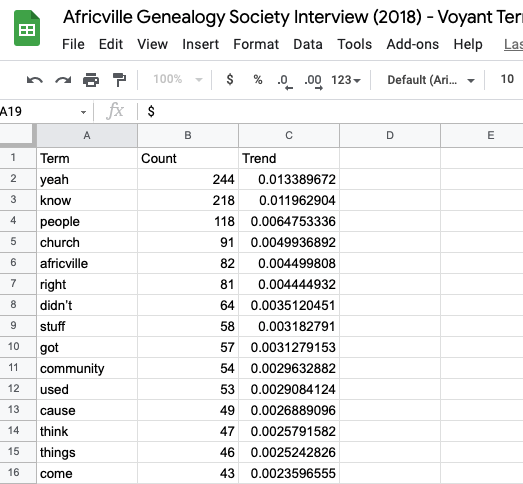
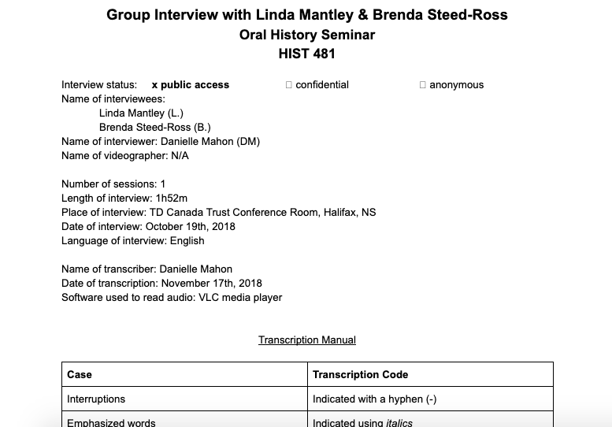

# Project: Sonifying Memory with Displacement Data 

## Idea

+ My digital creation project involves sonifying data taken by previous researchers about the displacement of Africville residents, and comparing that to my own oral history data filtered through the text-analysis tool, [Voyant](https://voyant-tools.org/?corpus=6d5d54eebc6cba72029f7e417e191edf)
+ The hope is to allow listeners the opportunity to listen to a different representation of the data that might be missed in visual representations, and offer interpretations that help listeners intimately connect with the past.
> [Sonification can] ask us to extend our senses, to heighten our awareness about an artifact, an archive, and history itself in terms of how we access it (Kramer & Noël 2020). 
+ Intended outcome: Create a geolocated soundwalk with the [Echoes App](https://echoes.xyz/)

## Choosing the Data
+ Why did I decide to use [the Africville Relocation Report](https://dalspace.library.dal.ca/handle/10222/55960) as one of my main sources of data? Well it's easily reproducible and is still one of the core primary sources of data used in writing any content about Africville and post-war housing developments in Halifax, NS.
+ My second main source of data, the interviews, are also reproducible but require tracking the decisions made when running the transcript through a text-analysis tool (it must be part of the *paradata*). For example, I've removed the verbal pauses that dominated the data (the 'uhm's, ahs, you knows') to highlight the important terms mentioned by participants. 

The following are images of the Voyant data pulled from one of my interviews with the founders of the Africville Genealogy Society.

## Project Tools

+ Currently, I'm using DeepSpeech to transcribe my interview data, Voyant to create text frequency data in a .csv file, and TwoTone to create sonified layers. 
+ I'd like to experiment with sonification using Python, but I'm not sure if I'll have enough time to move through that learning curve. I would also like to use Echoes (I'm using Echoes for my MRE project) to turn this soundscape into a sound walk, but I haven't fleshed out exactly how I might do that yet.

## Challenges so far

+ Transcription: DeepSpeech is not the most accurate tool for transcription, so I'm experimenting with transcribing smaller sections of the interview data to improve accuracy. I'll still need to go over the data to fill in the gaps.
+ I'm a bit concerned about using the oral history interviews in conjunction with the relocation data since there is so much data to sift through that it might take up too much time going through **five hour-long interviews**. So far I only have one interview fully transcribed, which is the one pictured about.
+ Alternatively, I could focus on sonifying the relocation data for a sound walk, post it on my static site, and add one sonified interview to the website for comparison. If anyone has any suggestions on where I could go with this project, I'd love to hear them!

## Future research avenues
+ So much has been written about Africville as an example of anti-blackness in urban renewal, post-war policy, civil rights controversy, and environmental racism. It would be interesting to do this sonification experiment to see what patterns arise in the recent literature on Africville - what do researchers focus on, what is being missed and can we sonify those patterns?

