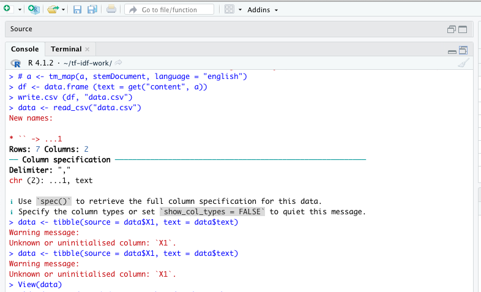
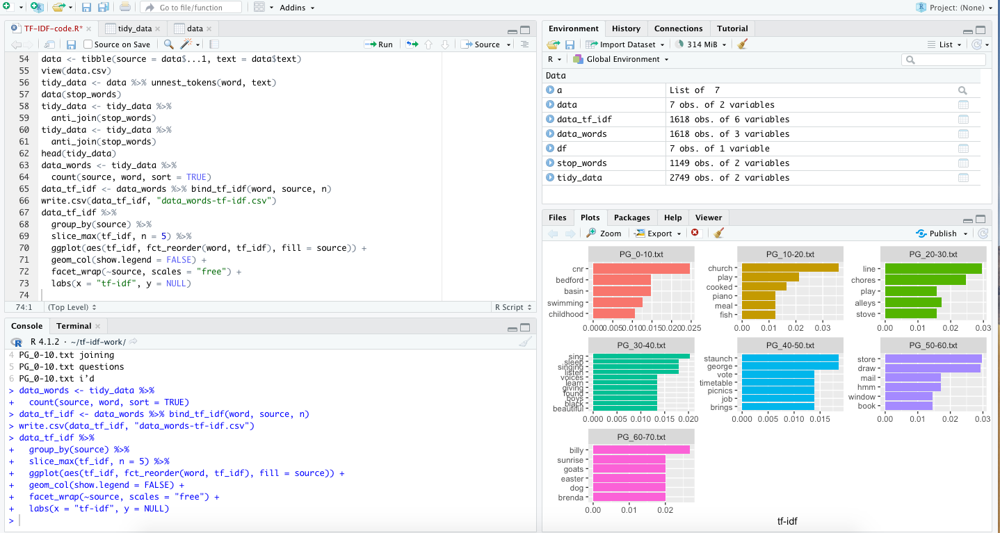

This week had its ups and major downs. I'll preface my log with stating that I spent more time trying to understand the *why* behind my process, and the tools I was using, rather than on creating another prototype in time for this log.

## I did a LOT of failing this week

+ Perfectionism and learning difficulties suck. They keep me from even wanting to use certain tools that may seem too difficult upon initial examination. Combatting this issue means asking for help, recognizing difficult learning curves as not a moral failure, but rather part of the advantage of learning at your own unique pace. 
+ This week I tried to pay attention to when I was feeling stuck and less confident in my ideas, and simply tried to enjoy learning something new.

## Here's how it went:

+ I transcribed one 1-hour interview (which took hours to do (about 2 days of work)).
+ Dr. Graham helped get me started with using TF-IDF with R-Studio. I wanted to use this text analysis tool since transcripts (flawed as they are in comparison to the act of listening to interviews for tone, silences, emphasis, etc.) are still used in oral history databases. Key words are especially important, since they indicate what content was mentioned/was significant in the interview. 
+ So I split the interview into text files according to 10 minute durations (I did this for two reasons: 1. To have a corpus of texts that someone could easily replicate since the transcript is timestamped and 2. Duration was a variable that works well for replicability on other interviews of the same length, and it would translate well to my sonified deliverable).
+ Then I ran the TF-IDF with R tutorial, and created a visualization of the data.

## Delaying the 'practical' to tackle the 'conceptual'
+ Those are the 'practical' successes from this week. I also spent a ton of time trying to understand the analytical significance of TF-IDF for oral history (so I supposed this is part of my paradata). 
+ In a few of the sources that I found on tf-idf in oral history work, it was used to create key words for interview searchability. However, I kept wondering if it had the potential to foster research questions [like Matthew K. Lavin's work with obituaries](https://programminghistorian.org/en/lessons/analyzing-documents-with-tfidf) and immerse the listener in a different way. Can there be a way to connect research & analysis with affect and immersion when analyzing transcripts? What if sonifying keywords layered with a soundscape based on themes mentioned in the interviews could add depth to a database, to OH transcript analysis? 
+ So I kept mulling over my decision to use TF-IDF and sonification to explore these questions, and I've come this far so I'm going to try to make it to the finish line. I think it's a worthy experiment, especially in the context of oral histories of displaced communities, where that affective feeling of loss wouldn't be obvious in the key words.
+ In essence, this week was a big struggle between balancing creation and understanding the purpose behind the experimentation.

## Some successes:

+ Having used R-Studio for the first time, I can into an issue with running the code for my files.
+ I ran into an error with the tibble command:

+ I actually reached out to one of my classmates, Sarah, for help solving this error. She helped me figure out that it was an issue with the column label X1. For my computer, R spit out the column name as ...1, so the code was trying to read the wrong label. 
+ After re-running the code with the correct label, I completed the tutorial and visualied the duration data from one of my interviews. 

## Next steps

+ My hope is that this project evokes emotional reactions to these terms by immersing the listener in audio samples of these terms, layered with a soundscape that evokes themes mentioned in those interviews.
+ I'll transcribe another interview, that of the first interviewee's brother, slice the transcript per 10 minutes, sample the key terms from the interview and place them in an audio file, then layer them with sounds I pulled from freesound.org. I've added some sounds to this repo if you'd like to hear them.
+ Once I get that prototype done, I need to figure out how to present the data (with Mural? on a plain blog page?)

